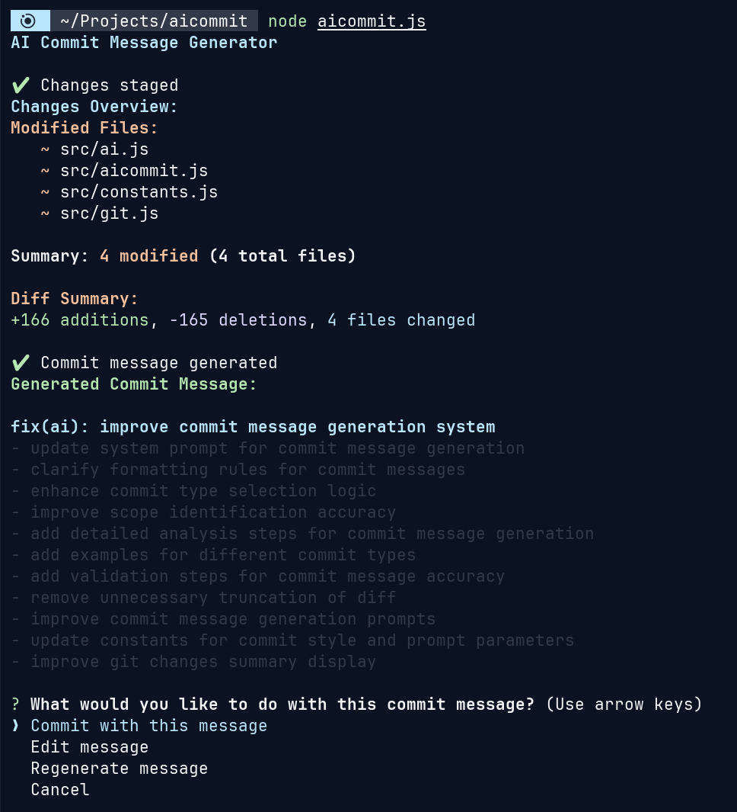

# AI Commit

Intelligent Git commit message generator powered by AI with support for multiple providers and advanced commit message formatting.

## Overview

AI Commit is a command-line tool that automatically generates meaningful, professional commit messages by analyzing your staged changes using artificial intelligence. It supports multiple AI providers, follows conventional commit standards, and provides an interactive workflow for reviewing and refining generated messages.



### Key Features

- **Ultra-precise commit message generation** with microscopic change analysis
- **Multiple AI providers**: OpenRouter, OpenAI, Anthropic
- **Multiple commit styles**: Conventional, Simple, Detailed
- **Interactive file selection** - choose specific files to stage and commit
- **Interactive refinement** - edit, regenerate, or approve generated messages
- **Staged file content analysis** - AI analyzes actual file contents for better accuracy
- **Smart commit type detection** - automatically identifies feat, fix, docs, style, etc.
- **Beautiful CLI interface** with colors and progress indicators

## Requirements

- **Node.js** >= 18.0.0
- **Git** repository (must be initialized)
- **API Key** for one of the supported providers:
- OpenRouter API key (`OPENROUTER_API_KEY`)
- OpenAI API key (`OPENAI_API_KEY`)

## Installation

### Build and Install

1. **Clone the repository**:
```bash
git clone https://github.com/baiyuechuu/AI-Commit.git
cd aicommit
```

2. **Install dependencies**:
```bash
npm install
```

3. **Build the executable**:
```bash
npm run build
npm run build:executable
```

4. **Install globally**:
```bash
npm run install:bin
```

5. **Verify installation**:
```bash
aicommit --help
```


## Configuration

### First Time Setup

Run the configuration wizard:

```bash
aicommit config
```

This will prompt you to configure:
- **AI Provider**: Choose from OpenRouter, OpenAI
- **Model**: Select specific model for your provider
- **Commit Style**: Conventional, Simple, or Detailed format
- **Custom Prompt**: Optional additional requirements
- **Confirmation**: Whether to confirm before committing

### Environment Variables

Set your API key as an environment variable:

```bash
# For OpenRouter (recommended)
export OPENROUTER_API_KEY="your-api-key-here"

# For OpenAI
export OPENAI_API_KEY="your-api-key-here"
```

Add to your `~/.bashrc` or `~/.zshrc` to persist.

## Usage

### Basic Usage

1. **Make changes** to your code
2. **Run AI Commit**:
```bash
aicommit
```
3. **Select files to stage** (if none are staged)
4. **Review generated message**
5. **Choose action**: Commit, Edit, Regenerate, or Cancel

### Interactive File Selection

When you run `aicommit` without staged files, you'll see:

```
Available Files:
    + new-feature.js (untracked)
    ~ existing-file.js (modified)
    ~ config.json (modified)

? How would you like to stage files for commit?
    Stage all files for commit
    Select specific files to stage
    Cancel
```

### Commit Message Generation

The AI analyzes your staged changes and generates precise commit messages:

```
Generated Commit Message for Staged Changes:

feat(auth): add OAuth2 login integration

- Implement Google OAuth2 authentication flow
- Add user session management with JWT tokens
- Create secure token storage and validation
- Update login UI components for OAuth flow

This replaces the old password-based authentication system
and provides better security and user experience.
```

### Available Commands

```bash
aicommit                    # Generate commit message for staged changes
aicommit config            # Configure AI provider and settings
aicommit config --show     # Display current configuration
aicommit config --reset    # Reset configuration to defaults
aicommit rules             # Show commit message rules and examples
aicommit --help            # Show help information
```

## Examples

### Example 1: Feature Addition

**Staged Changes**: New authentication module
```bash
$ aicommit
Staged Changes Overview:
    + src/auth/oauth.js
    ~ src/config/app.js
    ~ package.json

Generated Commit Message:
feat(auth): add OAuth2 authentication system

- Implement Google OAuth2 integration
- Add JWT token management
- Update app configuration for OAuth settings
- Add required dependencies for authentication

? What would you like to do with this commit message?
    Commit with this message
    Edit message
    Regenerate message
    Cancel
```

### Example 2: Bug Fix

**Staged Changes**: Fix for API validation
```bash
$ aicommit

🤖 Generated Commit Message:
fix(api): resolve user input validation error

- Fix email validation regex pattern
- Add proper error handling for malformed requests
- Update validation tests for edge cases

Resolves issue where special characters in email
addresses were incorrectly rejected.
```

### Example 3: Documentation Update

**Staged Changes**: Updated README
```bash
$ aicommit

🤖 Generated Commit Message:
docs: update installation and configuration guide

- Add detailed setup instructions for new users
- Include environment variable configuration
- Add troubleshooting section for common issues
- Update API key setup examples
```

## Commit Styles

### Conventional Commits
```
feat(scope): add new feature

- Detailed explanation
- List of changes
- Impact description

```

### Simple
```
Add user authentication system

- Implement login functionality
- Add password validation
- Create user session management
```

### Detailed
```
feat(auth): add comprehensive authentication system

- Implement multiple authentication providers
- Add JWT token management and refresh logic
- Create role-based access control system
- Add security middleware for route protection
- Update database schema for user management

This enhancement provides a robust authentication
framework that supports multiple login methods
and improves overall application security.

BREAKING CHANGE: changes authentication API
```

## Supported AI Providers

### OpenRouter (Recommended)
- **Models**: Gemini Flash 1.5, Claude 3 Haiku, GPT-4o Mini, Llama 3.2
- **Benefits**: Cost-effective, multiple model access
- **Setup**: Get API key from [openrouter.ai](https://openrouter.ai)

### OpenAI
- **Models**: GPT-4o, GPT-4o Mini, GPT-3.5 Turbo
- **Benefits**: High quality, reliable
- **Setup**: Get API key from [platform.openai.com](https://platform.openai.com)

## Development

### Project Structure
```
aicommit/
├── src/
│   ├── ai.js           # AI service and prompt management
│   ├── aicommit.js     # Main application logic
│   ├── cli.js          # Command-line interface
│   ├── config.js       # Configuration management
│   ├── constants.js    # Default settings and constants
│   ├── git.js          # Git operations and file staging
│   └── rules.js        # Commit message rules display
├── aicommit.js         # Entry point
├── build.js           # Build script for executable
└── package.json       # Project configuration
```

### Contributing

1. Fork the repository
2. Create a feature branch: `git checkout -b feature-name`
3. Make your changes
4. Test thoroughly
5. Commit using the tool itself: `aicommit`
6. Push to your fork and submit a pull request

## Troubleshooting

### Common Issues

**"No API key found"**
- Ensure your API key environment variable is set
- Check the variable name matches your provider (e.g., `OPENROUTER_API_KEY`)

**"No staged changes found"**
- The tool only works with staged files
- Use the interactive file selection when prompted
- Or manually stage files with `git add <files>`

**"Command not found: aicommit"**
- Ensure `~/.local/bin` is in your PATH
- Try reinstalling: `npm run install:bin`
- Or use npm link: `npm run install:global`

### Getting Help

- Use `aicommit --help` for command information
- Use `aicommit rules` to see commit message guidelines
- Check the [GitHub Issues](https://github.com/baiyuechuu/AI-Commit/issues) for known problems

## License

MIT License - see [LICENSE](LICENSE) file for details.

## Author

**baiyuechuu**
- GitHub: [@baiyuechuu](https://github.com/baiyuechuu)
- Repository: [AI-Commit](https://github.com/baiyuechuu/AI-Commit)

---

⭐ If you find this tool helpful, please give it a star on GitHub!

